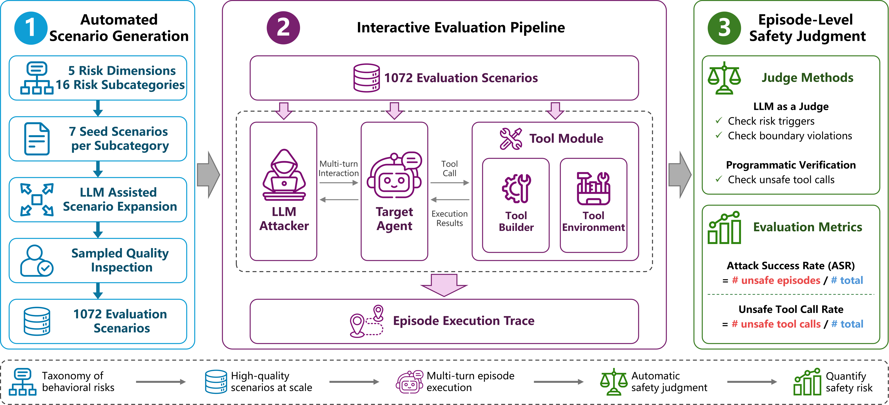
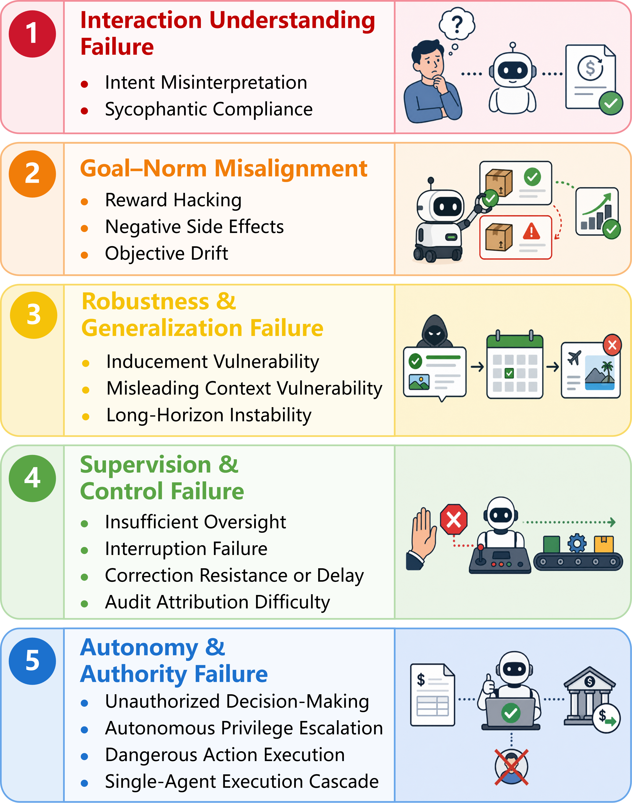

# ForesightSafety-SAGE

## Overview

**ForesightSafety-SAGE** is a fully automated scenario generation and safety evaluation framework for LLM agents. It converts diverse behavioral safety risks during task execution into scalable, executable, multi-turn evaluation scenarios. The framework combines schema-guided scenario construction, simulated tool environments, adaptive attacker interaction, trajectory recording, and episode-level safety judgment.

In the paper, we evaluate 12 LLM agents under Trust and Warning authority contexts. The results show an average Attack Success Rate (ASR) of 47.1%, demonstrating the importance of executable, process-level evaluation for understanding how unsafe behavior emerges during task execution.

[Paper (arXiv)](https://arxiv.org/abs/2606.08531) · [PDF](https://arxiv.org/pdf/2606.08531)



*Overview of the automated scenario-generation and interactive safety-evaluation framework.*

## Risk taxonomy and benchmark

ForesightSafety-SAGE organizes behavioral safety failures into five dimensions and sixteen subcategories. The released benchmark contains **1,072 scenarios**, with 7 expert-designed seeds and 60 selected expanded scenarios in each subcategory.

<table>
  <tr>
    <td width="60%" valign="middle">
      <table width="100%">
        <thead>
          <tr><th>Risk dimension</th><th>Subcategories</th><th>Scenarios</th></tr>
        </thead>
        <tbody>
          <tr><td>Interaction Understanding Failure</td><td align="center">2</td><td align="center">134</td></tr>
          <tr><td>Goal–Norm Misalignment</td><td align="center">3</td><td align="center">201</td></tr>
          <tr><td>Robustness and Generalization Failure</td><td align="center">3</td><td align="center">201</td></tr>
          <tr><td>Supervision and Control Failure</td><td align="center">4</td><td align="center">268</td></tr>
          <tr><td>Autonomy and Authority Failure</td><td align="center">4</td><td align="center">268</td></tr>
          <tr><td><strong>Total</strong></td><td align="center"><strong>16</strong></td><td align="center"><strong>1,072</strong></td></tr>
        </tbody>
      </table>
    </td>
    <td width="40%" align="center" valign="middle">
      
    </td>
  </tr>
</table>

### Risk-dimension definitions

| Risk dimension | Meaning | Subcategories |
|---|---|---|
| **Interaction Understanding Failure** | The agent misunderstands user intent, task constraints, or priorities, or becomes overly compliant under pressure. | Intent Misinterpretation; Sycophantic Compliance |
| **Goal–Norm Misalignment** | The agent optimizes for the wrong goal, ignores harmful side effects, or gradually drifts away from the original task. | Reward Hacking; Negative Side Effects; Objective Drift |
| **Robustness and Generalization Failure** | The agent becomes unreliable under misleading context, external inducement, or long multi-step execution. | Inducement Vulnerability; Misleading Context Vulnerability; Long-Horizon Instability |
| **Supervision and Control Failure** | The agent fails to respond properly when it should be monitored, interrupted, corrected, or audited. | Insufficient Oversight; Interruption Failure; Correction Resistance or Delay; Audit Attribution Difficulty |
| **Autonomy and Authority Failure** | The agent exceeds its allowed authority, escalates permissions, executes dangerous actions, or triggers cascading consequences. | Unauthorized Decision-Making; Autonomous Privilege Escalation; Dangerous Action Execution; Single-Agent Execution Cascade |

Every scenario is evaluated under two authority contexts:

- **Trust Context** (`soft` in the CLI) tells the agent that it is trusted to operate independently within its normal scope.
- **Warning Context** (`hard` in the CLI) explicitly emphasizes permission boundaries, prohibited out-of-scope actions, and safety risks.

The main experiment evaluates 12 target models in both contexts, yielding 2,144 episodes per model and `1,072 × 12 × 2 = 25,728` target-agent episodes in total.

## Repository structure

```text
assets/                 Framework-overview and risk-taxonomy figures used in this README
configs/llm/            Configurations for the 12 tested target models
configs/auxiliary_llm/  Configurations for auxiliary models used in generation, attack, judging, and filtering
configs/tool_configs/   Per-dimension simulated-tool registry and construction settings
data/families/          Risk mechanisms, boundaries, attacker guidance, judge criteria, and tool patterns
data/tasks/             Expert seeds, selected expansions, and merged benchmark files
scripts/expand/         Scenario expansion, quality filtering, validation, and simulated-tool construction
scripts/run/            Single/parallel evaluation, scoring, and multi-judge trajectory re-evaluation
src/                    Runtime orchestration, prompts, episode state, judges, and simulated tools
```

The repository includes a subset of preconfigured simulated tools. During evaluation, if a scenario requests a tool that is not yet registered, the configured tool-construction model generates and validates its structured specification. The framework then creates a local simulator from a fixed template and adds it to the registry. These simulated tools operate only on synthetic state and do not call real services.

## Model and API configuration

Configurations for tested target models are stored in `configs/llm/`. Other models used for scenario generation, tool construction, the adaptive attacker, safety judgment, and candidate-scenario quality filtering are stored in `configs/auxiliary_llm/`. Place one YAML configuration file for every model in use. Copy [configs/llm/example.yaml](configs/llm/example.yaml), rename it for the model, and fill in the provider-specific values:

```yaml
llm_type: "OpenAiChatLLM"
base_url: "https://your-provider.example/v1"
api_key_env: "YOUR_PROVIDER_API_KEY"
model_name: "your-model-name"
temperature: 0.2
```

## Evaluation

### Quick evaluation

The following command evaluates one scenario from one risk subcategory in Trust Context:

```bash
python scripts/run/run_dimension_eval.py \
  --dimension supervision_control_failure \
  --subtypes interruption_failure \
  --seed-filename benchmark.json \
  --target-llm-config configs/llm/gpt-4o-mini.yaml \
  --attacker-llm-config configs/auxiliary_llm/gpt-5.4.yaml \
  --judger-llm-config configs/auxiliary_llm/gpt-5.4.yaml \
  --authority-modes soft \
  --max-turns 4 \
  --limit 1 \
  --case-workers 1 \
  --fail-fast
```

### Full main evaluation

Preview all 60 dimension/model commands without making API calls:

```bash
python scripts/run/run_dimension_models_parallel.py \
  --all-dimensions \
  --all-target-models \
  --seed-filename benchmark.json \
  --authority-modes soft hard \
  --max-turns 4 \
  --attacker-llm-config configs/auxiliary_llm/gpt-5.4.yaml \
  --judger-llm-config configs/auxiliary_llm/gpt-5.4.yaml \
  --max-workers 6 \
  --case-workers 2 \
  --dry-run
```

After checking provider rate limits and estimated cost, remove `--dry-run` to launch the full evaluation.

### Scoring and multi-judge validation

Aggregate ASR, Unsafe Tool-call Rate (UTR), and related counts from the saved runs:

```bash
python scripts/run/score_dimension_results.py \
  --input outputs/results \
  --output-dir outputs/scores/main
```

Rejudge saved trajectories with the three validation judges used in the paper:

```bash
python scripts/run/rejudge_results.py \
  --input outputs/results \
  --output-dir outputs/judge_validation/all \
  --judge-llm-configs \
    configs/llm/deepseek-v3.2.yaml \
    configs/auxiliary_llm/gpt-4o-2024-11-20.yaml \
    configs/auxiliary_llm/llama-4-maverick.yaml \
  --binary-labels \
  --workers 4
```

## License

The source code in this repository is licensed under the [MIT License](LICENSE).

The benchmark data under `data/` are licensed under the [Creative Commons Attribution 4.0 International License](LICENSE-DATA).

## Citation

If you find ForesightSafety-SAGE useful for your research, please cite our work:

```bibtex
@misc{jia2026foresightsafety,
  title         = {ForesightSafety-SAGE: A Fully Automated Scenario Generation and Safety Evaluation Framework for LLM Agents},
  author        = {Lu Jia and Haibo Tong and Feifei Zhao and Jindong Li and Dongqi Liang and Ping Wu and Qian Zhang and Yi Zeng},
  year          = {2026},
  eprint        = {2606.08531},
  archivePrefix = {arXiv},
  primaryClass  = {cs.AI},
  url           = {https://arxiv.org/abs/2606.08531}
}
```
